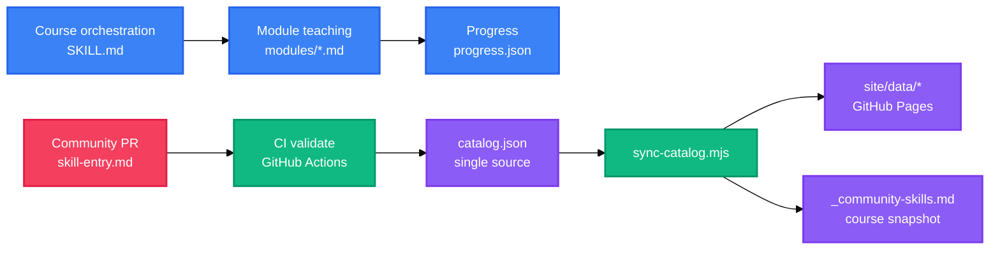

<h1 align="center">Claude Code Horse Tamer</h1>

<p align="center">
  <strong>A modular onboarding course that teaches you to tame Claude Code</strong>
  <br />
  <em>11 modules · multi-session continuation · real micro-exercises · two-phase teaching · community skill catalog</em>
</p>

<p align="center">
  <a href="https://github.com/anthropics/claude-code"></a>
  <a href="#quick-start"></a>
  <a href="#license"></a>
</p>

<p align="center">
  <a href="https://docs.anthropic.com/en/docs/claude-code"></a>
  
  
  
  
</p>

<p align="center">
  <a href="README.md">中文</a> · English
</p>

<p align="center">
  
</p>

---

Claude Code Horse Tamer (驯马师) is a Claude Code Skill plus an `/assist` slash command that teaches developers who can code but are new to Claude Code — taming Claude Code like a wild horse, from zero to productive on real tasks.

## Features

| Feature | Description |
|---|---|
| Modular course | 11 mechanism modules (Core → Capstone) in fixed order; one `/assist` teaches exactly one module |
| Multi-session continuation | Progress persisted in `.claude/cc-assistant/progress.json`; resumes from the last module without re-teaching |
| Real micro-exercises | One exercise per module tied to the learner's real project, done by the learner, never by the skill |
| Two-phase teaching | Beginner phase (all 11 modules, breadth) → advanced phase (optional deep dives + a capstone project) |
| Capstone integration | A cross-module task combining 2+ mechanisms plus a system overview (four-layer architecture / trigger mnemonic / selection decision tree, rewritten with attribution) |
| Community skill catalog | In-course snapshot plus a GitHub Pages site to browse community skills by topic / course module |

## Community Skill Catalog (what the community does)

This project does more than teach you Claude Code — it ships a **community skill catalog**. Community members submit useful Claude Code skills to the catalog; once a maintainer reviews and merges them, they become teaching material for the course:

1. **Community contribution** — any developer can submit a good skill using the template (see [`catalog/CONTRIBUTING.md`](catalog/CONTRIBUTING.md)); `catalog/catalog.json` is the single source of truth.
2. **Curate and distribute** — after a maintainer merges a PR, CI regenerates the course snapshot (`_community-skills.md`) and updates the web catalog (GitHub Pages `site/`).
3. **Teaching references** — every course module (e.g., Hooks / MCP / Agent SDK) has a "community good skills" section that shows recommended skills for that module's topics — after learning a mechanism, follow the recommendations to discover more skills you can use right away.
4. **Zero upload** — the course never goes online at runtime; it only reads the local snapshot, and installing any skill is your decision.

This forms a loop: **the course teaches you the mechanisms → the catalog helps you discover more good skills → and you can contribute back**, so the more active the community, the more good skills the course can point to.

## Quick Start

### Install

```bash
# Copy to the user-level skill directory (available in any project)
cp -r cc-assistant/SKILL.md cc-assistant/modules ~/.claude/skills/cc-assistant/
```

### Use

```bash
# Trigger the course in any project directory
/assist
```

## Usage

### First entry

Type `/assist` → M0 onboarding → pick a real project → answer "fresh start / resume".

### Module teaching

Each module follows "concept (what / when) → scenario demo → real micro-exercise"; the learner does the exercise.

### Multi-session continuation

Type `/assist` again → reads `progress.json` and resumes from `currentModule`; if the file is missing or corrupt it asks, never fails silently.

### Catalog commands (maintainers)

```bash
node catalog/validate.mjs              # structural validation (JSON / schema / id uniqueness / topics ⊆ vocabulary / mapping keys)
node catalog/sync-catalog.mjs          # regenerate site/data/ and the course snapshot
node catalog/sync-catalog.mjs --check  # drift check (exit 0 = consistent / 1 = drifted)
```

## Architecture



## Configuration

The catalog data layer is the single source of truth (machine-validated, not environment variables):

| File | Description |
|---|---|
| `catalog/catalog.json` | Single source of truth for skill entries (`skills` array) |
| `catalog/topics.json` | Topic vocabulary (machine-readable single source; each topic `id` + `description`) |
| `catalog/course-mapping.json` | Course module → topic mapping (no phase granularity) |

## Project Structure

```
cc-assistant/               # Course skill (orchestration layer + modules + eval)
├── SKILL.md                # Course orchestration (<200-word body)
├── modules/                # m0 onboarding + 11 course modules + community skill snapshot
└── eval/cases.md           # Scenario cases (TDD input)
catalog/                    # Community skill catalog data layer
├── catalog.json            # Single source of truth
├── topics.json             # Topic vocabulary
├── course-mapping.json     # Module → topic mapping
├── validate.mjs            # Structural validation script
└── sync-catalog.mjs        # Product generation + drift check
site/                       # GitHub Pages publish source (static site)
docs/                       # Manual / deployment guide / design inputs
```

## Tech Stack

| Layer | Technology | Purpose |
|---|---|---|
| Course engine | Markdown + Claude Code Skill | SKILL.md orchestration + module teaching |
| Catalog scripts | Node.js | `validate.mjs` / `sync-catalog.mjs` |
| Static site | HTML / CSS / JavaScript | `site/` client-side rendering and filtering |
| CI/CD | GitHub Actions | PR `validate` (read-only) + merge `sync` regeneration |
| Publishing | GitHub Pages | `site/` publish source |

## Deployment

GitHub Pages deployment steps (including `gh` CLI) are in [`docs/github-pages-部署.md`](docs/github-pages-部署.md). Core: push `main` → set Pages publish source to `site/` → the CI `sync` job regenerates automatically after catalog PRs merge, so the site needs no manual edits.

## Contributing

See [`catalog/CONTRIBUTING.md`](catalog/CONTRIBUTING.md): open a PR using the `.github/PULL_REQUEST_TEMPLATE/skill-entry.md` template → CI structural validation + drift check → maintainer review and merge → CI auto-regenerates the products.

## License

[MIT](LICENSE)

<!-- BEAUTIFIED -->
