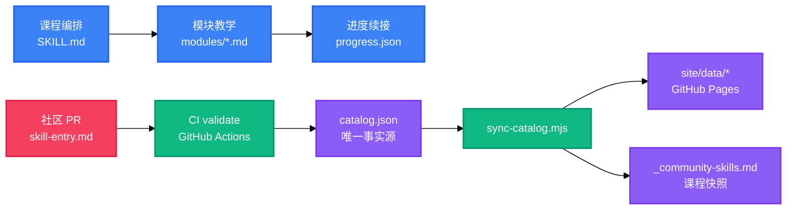

<h1 align="center">Claude Code Horse Tamer</h1>

<p align="center">
  <strong>驯服 Claude Code 这匹烈马的模块化上手引导课程</strong>
  <br />
  <em>11 模块 · 多会话续接 · 真实小练习 · 两阶段教学 · 社区 Skill 目录</em>
</p>

<p align="center">
  <a href="https://github.com/anthropics/claude-code"></a>
  <a href="#快速开始"></a>
  <a href="#license"></a>
</p>

<p align="center">
  <a href="https://docs.anthropic.com/en/docs/claude-code"></a>
  
  
  
  
</p>

<p align="center">
  中文 · <a href="README-en.md">English</a>
</p>

<p align="center">
  
</p>

---

Claude Code Horse Tamer（驯马师）是一个 Claude Code Skill + `/assist` 斜杠命令，给「有开发经验、但不会用 Claude Code」的开发者，用**真实任务边做边教**——像驯服烈马一样驯服 Claude Code，完成从零基础到能独立干活。

## 功能特性

| 特性 | 说明 |
|---|---|
| 模块化课程 | 11 个机制模块（核心 → 收官整合），固定次序推进，一次 `/assist` 只教 1 个 |
| 多会话渐进续接 | 进度存 `.claude/cc-assistant/progress.json`，中断后从上次模块续接，不重讲已完成模块 |
| 真实小练习 | 每模块一个与学习者真实项目串联的练习，由学习者动手、skill 不代做 |
| 两阶段教学 | 进阶必修（11 模块广度）→ 高阶可选（重点模块深入实操 + 综合项目） |
| 收官整合 | 组合 2+ 机制的综合任务 + 体系讲解（四层架构 / 触发口诀 / 选型决策树，改写归因） |
| 社区 Skill 目录 | 课程内置快照 + GitHub Pages 静态站，按主题 / 课程模块筛选社区 skill |

## 社区 Skill 目录（社区的作用）

这个项目不只教你学 Claude Code，还带一个**社区 Skill 目录**——社区成员（网友）把好用的 Claude Code skill 提交进目录，经维护者审核收录后，成为课程的教学素材：

1. **社区贡献**：任何开发者都能按模板提交一条好用的 skill（见 [`catalog/CONTRIBUTING.md`](catalog/CONTRIBUTING.md)），目录以 `catalog/catalog.json` 为唯一事实源。
2. **收录与分发**：维护者审核合入后，CI 自动生成「课程快照」（`_community-skills.md`）并更新网页目录（GitHub Pages `site/`）。
3. **教学引用**：课程每个模块（如 Hooks / MCP / Agent SDK）的「社区好 skill」小节，展示本模块对应主题的推荐 skill——学完一个机制，顺着推荐就能发现更多能直接上手的好 skill。
4. **零上传**：课程运行时不联网，只看本地快照；是否安装由你自己决定。

这样形成闭环：**课程教你用机制 → 目录帮你发现更多好 skill → 你也能贡献回来**，社区越活跃、课程能引用的好 skill 越多。

## 快速开始

### 安装

```bash
# 复制到用户级技能目录（任意项目可用）
cp -r cc-assistant/SKILL.md cc-assistant/modules ~/.claude/skills/cc-assistant/
```

### 使用

```bash
# 在任意项目目录触发课程
/assist
```

## 使用方法

### 首次进入

输入 `/assist` → M0 定场说明 → 选定一个真实项目 → 询问「全新开始 / 此前学过想续接」。

### 模块教学

每个模块按「概念（是什么/何时用）→ 场景演示 → 真实轻练习」推进，练习由学习者自己动手。

### 多会话续接

再次 `/assist` → 自动读取 `progress.json`，从上次 `currentModule` 续接；文件缺失/损坏时询问定位，不静默出错。

### 目录命令（维护者）

```bash
node catalog/validate.mjs              # 结构校验（JSON / schema / id 唯一 / topics ⊆ 词表 / 映射键一致）
node catalog/sync-catalog.mjs          # 重新生成 site/data/ 与课程快照
node catalog/sync-catalog.mjs --check  # 防漂移检查（退出码 0=一致 / 1=漂移）
```

## 架构



## 配置

目录数据层为唯一事实源（机器校验，非环境变量）：

| 文件 | 说明 |
|---|---|
| `catalog/catalog.json` | skill 条目唯一事实源（`skills` 数组） |
| `catalog/topics.json` | 主题词表（机器可读唯一源，每主题 `id` + `description`） |
| `catalog/course-mapping.json` | 课程模块 → 主题标签映射（无 phase 粒度） |

## 目录结构

```
cc-assistant/               # 课程 skill（编排层 + 模块 + eval）
├── SKILL.md                # 课程编排层（正文 <200 词）
├── modules/                # m0 定场 + 11 课程模块 + 社区 skill 快照
└── eval/cases.md           # 场景用例（TDD 输入）
catalog/                    # 社区 Skill 目录数据层
├── catalog.json            # 唯一事实源
├── topics.json             # 主题词表
├── course-mapping.json     # 模块 → 主题映射
├── validate.mjs            # 结构校验脚本
└── sync-catalog.mjs        # 三产物生成 + 防漂移
site/                       # GitHub Pages 发布源（静态站）
docs/                       # 使用说明书 / 部署指南 / 设计输入
```

## 技术栈

| 层 | 技术 | 用途 |
|---|---|---|
| 课程引擎 | Markdown + Claude Code Skill | SKILL.md 编排 + modules 教学 |
| 目录脚本 | Node.js | `validate.mjs` / `sync-catalog.mjs` |
| 静态站 | HTML / CSS / JavaScript | `site/` 客户端渲染与筛选 |
| CI/CD | GitHub Actions | PR `validate` 只读 + 合入 `sync` 再生成 |
| 发布 | GitHub Pages | `site/` 发布源 |

## 部署

GitHub Pages 部署步骤（含 `gh` CLI）见 [`docs/github-pages-部署.md`](docs/github-pages-部署.md)。核心：推 `main` → 设置 Pages 发布源为 `site/` → CI `sync` job 在目录 PR 合入后自动再生成，网页无需人工改动。

## 贡献

给社区 Skill 目录加一条 skill，5 步：

1. 在 `catalog/catalog.json` 的 `skills` 数组末尾加条目——字段 `id` / `name` / `description`（说明「何时用」）/ `author` / `install` / `repo`（http/https）/ `license` / `topics`（须来自 `catalog/topics.json`，≥1）
2. 本地校验 + 重新生成产物（退出码必须 0，再生成的三产物要一起提交）：
   ```bash
   node catalog/validate.mjs          # 结构校验（JSON / schema / id 唯一 / topics ⊆ 词表 / 映射键）
   node catalog/sync-catalog.mjs      # 重新生成 site/data/ 两文件 + 课程快照
   ```
3. 按 `.github/PULL_REQUEST_TEMPLATE/skill-entry.md` 模板提 PR
4. CI `validate` job 自动校验（结构 + 防漂移）→ 维护者审核合入
5. 合入后 CI 自动再生成 → **网页目录 + 课程快照自动更新**

详见 [`catalog/CONTRIBUTING.md`](catalog/CONTRIBUTING.md)（收录判据、被拒常见原因）。

## License

[MIT](LICENSE)

<!-- BEAUTIFIED -->
